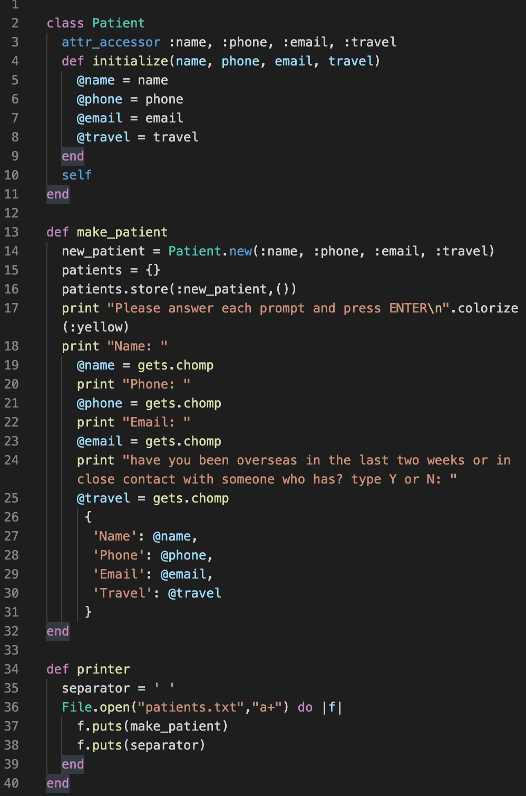
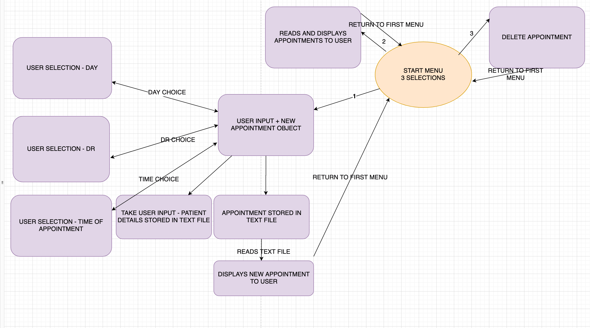
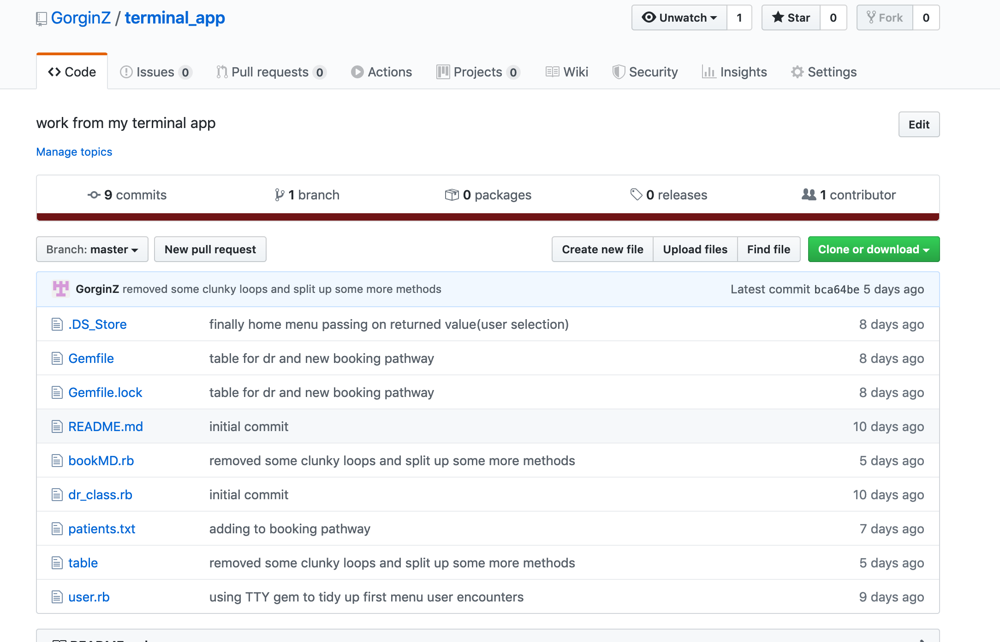
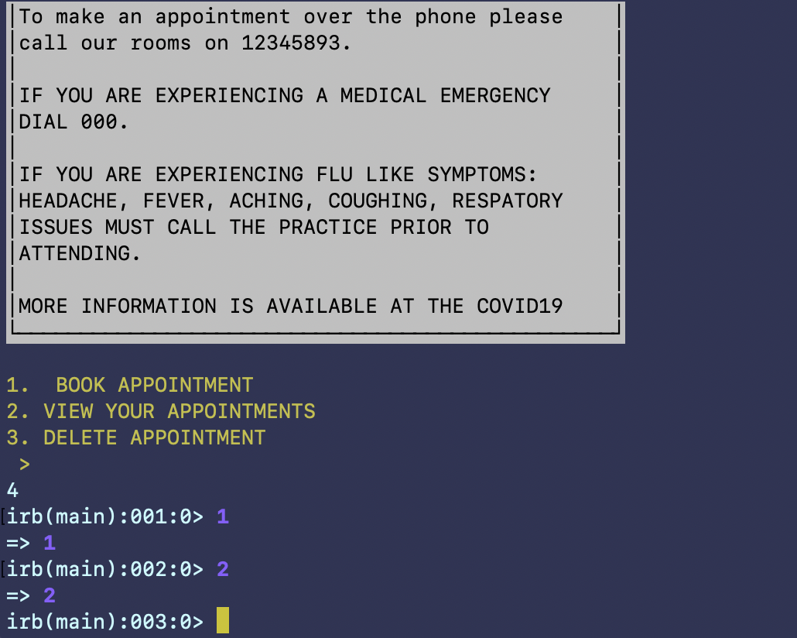

# BookMD

## Installation

Add this line to your application's Gemfile:

```ruby
gem 'BookMD'
```

And then execute:

    $ bundle install

Or install it yourself as:

    $ gem install BookMD
    
## Statement of purpose    
BookMD is a mock online dr appointment booker. BookMD takes user input from an appointment selection as well as patient information and writes this to text files and reads these text files to display the selections back to the user. It also allows users to cancel their appointments and make a new appointment if they want to change the appointment time. BookMD will return the user to the home menu ten seconds after it completes the requested function and displays a message to confirm to the user it has completed the function and will return them 'home'.

## A problem BookMD helps to solve...
(...)is the dr selection process. Booking online isn't really any simpler or easier in terms of user experience and this is reflected in any online appointment booking app that most of us have used - but online booking can address some other issues people may have if attending a practice as a new patient. An app that displays dr availability and also provides profiles with Dr information, areas of interest and the like provides something that can't be done on the phone and allows for people (especially new patients) to select a practitioner they feel meets their needs as a patient. The target audience for BOOKMD is anyone looking online for a new GP.

## BookMD and ethical issues
Any real appointment booker handling personal information and health information raises obvoius issues about how the data is stored, obtained and accessed, these are fairly broad and well understood issues so instead I would like to aknoelrdge this but instead comment on issues that would be specific to a medical appointment services (given my app is a mock booker and isn't actually handling data). 

The aim of BookMD is to make appropriate care more accessible by allowing practices to have profiles for their GPs and help people find care more appropriate for them. Many women or chronic pain sufferers struggle navigating the medical industry and landing themselves a good regular GP because you just have to go and see what they're like - reviews aren't particularly useful and can often be misguided if people just didnt like the dr on an interpersonal level - what can be ueful is GPs who have special areas of interest being able to state their history and experience clearly in a profile. BookMD in the spirit of this goal would also not allow non-bulk billing practices or practices that don't do workcover or tac work to use their platform.


## Usage

BookMD starts at a home menu with three pathways.

## Development

## Features

BookMD is just a mock appointment booker and isn't able to capture the dynamism or security necessary in a booking system but aims to capture three basic key functions through the executable console app:

## 1 - take user input and store as patient details.
the make_patient method is called when the user progresses through the book appointment pathway. This method initializes a new object of the Patient class and assigns the attribute variables for name, phone, email and travel via gets-ing user input. 
The scope of the Patinet class instance variables means I am able to attribute these values to new objects of this class in the make_patient method. 


## 2- storing appointment-(DR, day and time) selection using a selection menu. 

## 3 -allowing to cancel appointments the user has created.
 BookMD handles user input that generates two kinds of class objects - patient objects, and appointment objects.

After checking out the repo, run `bin/setup` to install dependencies. Then, run `rake spec` to run the tests. You can also run `bin/console` for an interactive prompt that will allow you to experiment.

To install this gem onto your local machine, run `bundle exec rake install`. To release a new version, update the version number in `version.rb`, and then run `bundle exec rake release`, which will create a git tag for the version, push git commits and tags, and push the `.gem` file to [rubygems.org](https://rubygems.org).

Pathway


Planning and development of project


 this is my old repo - because I made this project a gem I created a new repo with the name of the application. 

##Testing

 my app has a lot of bugs as things stand. 

## Contributing

Bug reports and pull requests are welcome on GitHub at https://github.com/[USERNAME]/BookMD. This project is intended to be a safe, welcoming space for collaboration, and contributors are expected to adhere to the [code of conduct](https://github.com/[USERNAME]/BookMD/blob/master/CODE_OF_CONDUCT.md).


## License

The gem is available as open source under the terms of the [MIT License](https://opensource.org/licenses/MIT).

## Code of Conduct

Everyone interacting in the BookMD project's codebases, issue trackers, chat rooms and mailing lists is expected to follow the [code of conduct](https://github.com/[USERNAME]/BookMD/blob/master/CODE_OF_CONDUCT.md).
